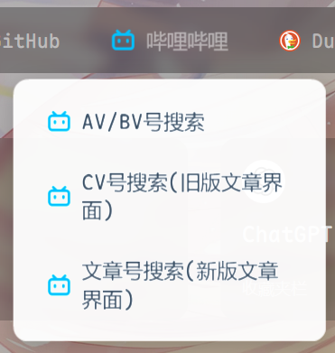

# 书签导航页

一个美观、快速的书签导航页。

网页预览:[大陆访问不友好](https://bookmarks-cmyyx.netlify.app/)
[![Hosted on Netlify]


(https://www.netlify.com/img/global/badges/netlify-color-accent.svg)](https://app.netlify.com)


搜索引擎支持嵌套,能显示子搜索引擎菜单




## ✨ 主要特性

- **全自动处理**：只需提供书签文件，脚本会自动完成所有工作。
- **智能图标获取**：自动从多个备用源抓取最合适的网站图标，并跳过无效或占位符图标。
- **纯静态输出**：生成的网站不依赖任何后端服务，可以轻松部署在任何地方（如 GitHub Pages, Vercel 等）。
- **高度可定制**：通过 `src/config.json` 文件，您可以轻松自定义搜索引擎、快捷方式等。
- **高效稳定**：采用并发请求以加快图标获取速度，并内置了强大的错误处理和重试逻辑。

## 快速上手 (Quick Start)

推荐查看[我的博客](https://blog.cmtyx.top/posts/0%E6%88%90%E6%9C%AC%E5%BF%AB%E9%80%9F%E6%90%AD%E5%BB%BA%E4%B8%80%E4%B8%AA%E5%B1%9E%E4%BA%8E%E8%87%AA%E5%B7%B1%E7%9A%84%E4%B9%A6%E7%AD%BE%E5%AF%BC%E8%88%AA%E9%A1%B5/),这里会详细一些(

1.  **Fork 本仓库**
    点击页面右上角的 "Fork" 按钮，将此仓库复制到你自己的 GitHub 账户下。

2.  **替换书签文件**
    将你常用的浏览器书签导出为 `bookmarks.html` 文件，然后用它替换掉仓库根目录下的 `bookmarks.html` 文件。

完成以上两步后，你的书签主页就可以部署了。

## 部署 (Deployment)

你可以将此项目部署到任何静态托管平台（如 Vercel, Cloudflare Pages, Netlify 等）。

在平台的项目设置中，请填写以下信息：

- **构建命令 (Build Command):** `npm run build`
- **输出目录 (Output Directory):** `dist`

### 本地使用

如果你希望在本地环境运行：

1.  确保你已安装 [Node.js](https://nodejs.org/)。
2.  在项目根目录执行 `npm install` 来安装依赖。
3.  执行 `npm run build` 来构建项目。
4.  构建产物将位于 `dist` 目录，你可以将其部署到任何静态服务器，或直接在浏览器中打开 `dist/index.html`。

## 自定义 (Customization)

所有自定义选项均在 [`src/config.json`](src/config.json) 文件中配置。

### 搜索引擎配置

这是核心功能之一。你可以在 `searchEngines` 对象中添加、修改或删除搜索引擎。

*   **结构**: 这是一个对象，每个键代表一个搜索引擎的标识符（如 "google"）。
*   **占位符**: 在 `url` 中使用 `{query}` 作为搜索词的占位符。
*   **嵌套引擎**: 你可以在一个搜索引擎内部定义一个 `engines` 对象，以创建子搜索引擎（例如，Bilibili 的视频搜索和专栏搜索）。

**格式示例：**
```json
"searchEngines": {
  "google": {
    "name": "Google",
    "url": "https://www.google.com/search?q={query}",
    "icon": ""
  },
  "bilibili": {
    "name": "哔哩哔哩",
    "url": "https://search.bilibili.com/all?keyword={query}",
    "icon": "https://www.bilibili.com/favicon.ico",
    "engines": {
      "bv": {
        "name": "AV/BV号搜索",
        "url": "https://www.bilibili.com/video/{query}",
        "icon": ""
      }
    }
  }
}
```

### 背景设置

你可以修改 `background` 部分来设置背景。

*   **本地静态背景**: 默认使用 `fallback` 字段指定的本地背景图片。
*   **API 动态背景**: 将 `api.enabled` 设置为 `true` 并配置API以通过API获取背景图片。

### 高级自定义

*   **修改字体**: 替换 [`src/assets`](src/assets) 目录中的字体文件，并在 [`src/style.css`](src/style.css) 中更新字体名称。
*   **修改默认图标**: 替换 [`src/assets/placeholder_icon.svg`](src/assets/placeholder_icon.svg) 文件来修改网站的默认占位符图标。
*   **构建设置**: [`buildSettings`](src/config.json) 用于配置图标抓取服务的超时和并发数，通常无需修改。

## 面向开发者 (For Developers)

如果你对本项目的技术实现感兴趣或希望参与贡献，请查阅 [`README.dev.md`](README.dev.md) 以获取更详细的开发和构建信息。

我们欢迎并鼓励社区通过提交 Issues 和 Pull Requests 来帮助我们改进项目。
